<a name="TOP"></a>

<div class="frmttng">

<h1> {{page.title}} </h1>

</div>

Created: 2015-02-14.  Updated: 2015-06-29. **GUI Documentation** contains an in-depth description of all the features in the RCloud GUI.  RCloud documentation is currently maintained by <a target="_blank" href="http://www.spencerseidel.com">Spencer Seidel</a> on a voluntary basis.

<div markdown="1" class="frmttng">

## Table of Contents

1. [Getting Started](#gettingstarted)
1. [Parts of the GUI](#partsofthegui)
    * [GUI Navigation](#guinavigation)
        * [Opening and Closing Panels](#openingandclosingpanels)
        * [Opening and Closing All Panels](#openingandclosingallpanels)
        * [Changing Panel Width](#changingpanelwidth)
1. [The Header Bar](#theheaderbar)
1. [Cells](#cells)
    * [Prompt Cells](#rpromptcells)
    * [Markdown Cells](#Markdowncells)
        * [Adding R Code](#addingrcode)
        * [Markdown](#markdown)
        * [Running your code](#runningyourcode)
        * [Editing and Viewing Results](#editingandviewingresults)
        * [Adding and Deleting Markdown Cells](#addinganddeletingMarkdowncells)
    * [Cell Run-State Indicator](#cellrunstateindicator)
    * [Stopping Cell Execution](#stoppingcellexecution)
    * [Rearranging Cells](#rearrangingcells)
    * [Joining Cells](#joiningcells)
    * [Markdown Vs. RMarkdown Cells](#markdownvsrmarkdowncells)
1. [Notebooks](#notebooks)
    * [Creating a Notebook](#creatinganotebook)
    * [Running a Notebook](#runninganotebook)
    * [Long-Running Notebooks](#longrunningnotebooks)
    * [Forking (Copying) a Notebook](#forkingcopyinganotebook)
    * [Saving Your Work](#savingyourwork)
        * [Manual Saving](#manualsaving)
        * [Versioning](#versioning)
            * [Version Tagging](#versiontagging)
            * [Reverting to a Previous Version](#revert)
    * [Public and Private Notebooks](#publicandprivatenotebooks)
        * [Toggle Private](#toggleprivate)
        * [Toggle Public](#togglepublic)
    * [Deleting Notebooks](#deletingnotebooks)
    * [Sharing Your Notebooks](#sharingyournotebooks)
        * [view.html](#view.html)
        * [notebook.R](#notebook.R)
        * [mini.html](#mini.html)
        * [shiny.html](#shiny.html)
    * [Who Starred my Notebook?](#whostarredmynotebook)
    * [Saving Plots](#savingplots)
    * [Find/Find Replace](#findreplace)
1. [Data Access](#dataaccess)
    * [File Upload](#fileupload)
    * [Upload to Notebook](#uploadtonotebook)
1. [Notebook Assets](#notebookassets)
    * [Data as an Asset](#dataasanasset)
    * [Uploading Assets](#uploadingasset)
    * [Cascading Style Sheets](#usingcss)
    * [JavaScript](#jsmode)
    * [Renaming Assets](#assetrename)
1. [notebook.R URLs](#notebookrurls)
1. [Search](#search)
    * [Complex Searches](#complexsearches)
1. [Settings](#settings)
    * [Show Command Prompt](#showcommandprompt)
    * [Show Terse Version Dates](#showterseversiondates)
    * [Subscribe to Comments](#subscribetocomments)
    * [Extensions](#extensions)
1. [Comments](#comments)
    * [Editing Comments](#editingcomments)
    * [Deleting Comments](#deletingcomments)
1. [Help](#help)
1. [Workspace](#workspace)
1. [Dataframe](#dataframe)
1. [Session](#session)
1. [RStudio Shiny Support](#rstudioshinysupport)

</div>

<a name="gettingstarted"></a>

## 1. Getting Started

RCloud supports Chrome, Chromium (the open-source version of Chrome), and Firefox web browsers, so you'll need to download the latest version of any of these to get started.

Next, RCloud uses GitHub technology to store information about users and their RCloud notebooks. Therefore, a new user must register with their installation's instance of GitHub. Please refer to your installation's local documentation about creating new users.

Finally, every installation's networking architecture will be different. Please refer to your installation's local documentation for any relevant information.

[Top](#TOP)

<a name="partsofthegui"></a>

## 2. Parts of the GUI


[Top](#TOP)

<a name="guinavigation"></a>

### GUI Navigation

<a name="openingandclosingpanels"></a>

#### Opening and Closing Panels

Clicking on the title of a panel opens and closes (and resizes in some cases) RCloud panels, such as Notebooks and Search. 

[Top](#TOP)

<a name="openingandclosingallpanels"></a>

#### Opening and Closing All Panels

When all RCloud panels are minimized in a column, a "+" sign will appear, as shown here.


Clicking the "+" sign will restore all panels in the column to their previous sizes. Now, a "-" sign will appear, shown below, which will minimize all open panels in a column.

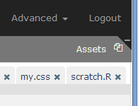

[Top](#TOP)

<a name="changingpanelwidth"></a>

#### Changing Panel Width

To change the width of a panel, hover your mouse over the the edge that touches the cells in the middle. When it changes into a double arrow, click and drag left and right to resize.

[Top](#TOP)

<a name="theheaderbar"></a>

## 3. The Header Bar

Here is the RCloud header bar:


: Please see the [Sharing Your Notebooks](#sharingyournotebooks) section for more information.

: Click the star icon to toggle the appearance of the current notebook in the My Interests area on the left sidebar. The icon displays the number of RCloud users who have added the notebook to their interests. In the case shown above, five users have done so.

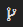: Click the fork icon to make a new copy of a notebook for editing.

: Whenever you run a notebook, RCloud automatically saves a revision in GitHub. If you need to close your RCloud session immediately without waiting for a lengthy run time, click the save icon to save a revision immediately.

: Click the play icon to run all [markdown and prompt cells](#cells) in the current notebook. Cells are executed asynchronously. RCloud displays the output as it becomes available.

<a name="notebooktitle"></a>
: This is the title of the current notebook. In this case, "Markdown Basics." Click the title to change it.

Note that you can create sub-directories simply by adding any number of forward slashes '/', like on a Unix command line. E.g. Cookbook for R/1 - Basics/1.1 - Indexing into a Data Structure. If the sub-directories don't already exist, RCloud will create them on the fly, so there is no need to create individual sub-directories before changing the name of your notebook. Sub-directories allow you to group your notebooks and will be displayed in a tree-like hierarchy in the [Notebooks section](#notebooks) of the left sidebar.

Also, if the notebook was created as a result of [forking another notebook](#forkingcopyinganotebook), the forked notebook name is displayed in a smaller font beneath the current notebook's title.


Click the Advanced tab to access more features:

* **Open in GitHub**: Notebooks are stored as GitHub "gists," although you'll rarely need to interface directly with GitHub. This means you get all the power of a source-control versioning system for free. Behind the scenes, GitHub stores every revision of your notebooks, so you can retrieve them later, if necessary. In the GitHub web interface, you can delete your notebooks, edit the text, or change the privacy settings, among other things. For more about using the GitHub interface see [the GitHub help pages](https://help.github.com/).
* **Load Notebook by ID**: Replace the current notebook with another via URL or GitHub Gist ID.
* **Import External Notebooks**: Using this dialog, you can import multiple notebooks stored in another GitHub repository. You'll need the source GitHub repository API URL and a list of notebook IDs, newline separated. In addition, you can supply a prefix that will cause all the imported notebooks to go into a folder. E.g. "myfolder/". Note the trailing '/' character.
* **Export Notebook to File**: Your browser will automatically save a copy of the current notebook in JSON format in whatever directory you've designated for downloads. The file name will be the same as your notebook with a .gist extension.
* **Import Notebook from File**: In order to import a notebook, it must be in the same format as an exported notebook. Once you specify the notebook's location, you can validate the notebook by clicking the word "Validate." To import, click the Import button.
* **Export Notebook as R Source File**: When selected, your browser will download an R source text file named after your notebook with .R appended.
* **Publish Notebook**: By default, users who wish to view your notebooks must be logged into RCloud. If the Publish Notebook box is checked, *any* user who has network access to the notebook's URL will be able to view the notebook. Obviously, editing features will be turned off for these users.

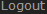: Click Logout to end your RCloud session.

[Top](#TOP)

<a name="cells"></a>

## 4. Cells

There are two types of cells in RCloud, both used for inserting code. The first is the **prompt** cell, which allows you to interact with RCloud in more-or-less command-line fashion. Prompt cells are useful for quick, interactive sessions.

Prompt cells support either R or Python, which you can specify in the pull-down menu to the right of each cell:


Note that "data marshalling," or using objects between cells of different languages, is not supported at this time.

The second type is the **markdown** cell. Markdown cells are better suited for cutting and pasting chunks of R code and adding simple formatted documentation. Note that markdown cells do not currently support Python.

We'll get to the difference between Markdown and RMarkdown cells in a moment.

[Top](#TOP)

<a name="rpromptcells"></a>

### Prompt Cells


Prompt cells mostly act like an interactive R or Python shell. Type a line of code, press Enter/Return, and the command is immediately executed. When RCloud is finished, you're presented with the result and a new prompt cell.

For example, here's the result of pressing Enter/Return after typing a command:

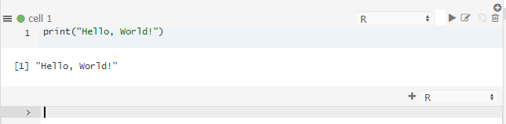

Note that after executing a command, RCloud presents several icons that allow you to interact with the cell: , , , and . Here's a brief description of each:

*  Run the code in the cell.
*  Edit the code in the cell (clicking on your code also enables editing).
*  Split the cell into two parts at the cursor.
*  Delete the cell.

Another way to interact in multi-line mode with prompt cells is to cut and paste multiple lines of code into the cell. When you do, you'll see something like this:

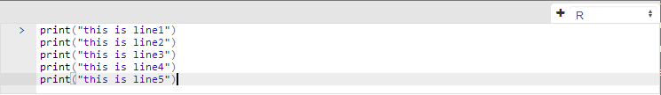

To execute the code, simply put your cursor at the end of the last line and press Enter/Return.

Note that it is currently not possible to insert a prompt cell above an existing prompt cell. The only way to add new prompt cells is by executing the current prompt cell. When you do, a new cell is created under the existing one.

[Top](#TOP)

<a name="Markdowncells"></a>

### Markdown Cells


[Top](#TOP)

<a name="addingrcode"></a>

#### Adding R Code

Markdown cells are where you enter and edit blocks of multi-line R markdown. Markdown is a plain-text formatting syntax used to create simple formatted documents. In order to differentiate your R code from text, surround your R code with the following (back ticks, brackets and "r"):

<pre>
```{r}
## R code goes here
print("Hello World!")
```
</pre>

[Top](#TOP)

<a name="markdown"></a>

#### Markdown

Here's some sample markdown, suitable for cutting and pasting into a markdown cell:

<pre>

## Markdown Basics

This is plain text. Empty lines are interpreted as new paragraphs. Single newlines
are ignored by the markdown renderer.

## Code Samples

If you'd like to include code samples in your markdown, indent each line with
at least 4 spaces or a tab. Here's a hello world in R, for example.

    print ("hello, world!", quote = FALSE)
    print ("some more text")

## Emphasis

**For bold text, use two asterisks**. *For italics, use one*.

## Lists

Use an asterisk before each list item on a newline for unordered lists:

* this is a
* list

To produce an ordered list, use a number before each list item. Any number 
will do. The markdown renderer will ignore the number prefix you provide and count the list 
items itself:

1. this is an ordered
1. list

## And here's our hello world R program

```{r}
print ("hello, world!", quote = FALSE)
print ("some more text")
```
</pre>

[Top](#TOP)

<a name="runningyourcode"></a>

#### Running your code

When you're done editing in a markdown cell, click the  icon to the right of the cell. Here is the result:


Full documentation of markdown syntax is available [here](http://daringfireball.net/projects/markdown/syntax).

[Top](#TOP)

<a name="editingandviewingresults"></a>

#### Editing and Viewing Results

If you find a typo or would like to otherwise edit your R code, click the  icon. You can also click on any code portions of the output to enter edit mode.

[Top](#TOP)

<a name="addinganddeletingMarkdowncells"></a>

#### Adding and Deleting Markdown Cells

To insert a markdown cell above, click the  icon. To insert a markdown cell below, click the  icon. To delete a markdown cell altogether, click the  icon.

[Top](#TOP)

<a name="cellrunstateindicator"></a>

### Cell Run-State Indicator

The run-state of each cell is displayed via an icon in between the gutter and cell name:

: Cell has not been run

: Cell is scheduled to be run

: Cell is running

: Cell has run successfully

: Cell ran but had errors

: Cell's run was cancelled

[Top](#TOP)

<a name="stoppingcellexecution"></a>

### Stopping Cell Execution

When you run a notebook, you can prevent scheduled cells from running by pressing the stop button, located in the header at the top of the screen:


Note that this will not interrupt currently running cells. (). It will only prevent scheduled cells from running.

[Top](#top)

<a name="rearrangingcells"></a>

### Rearranging Cells

To rearrange your cells, click and drag the blank status area above the cell or the  icon to the left of the cell.

[Top](#TOP)

<a name="joiningcells"></a>

### Joining Cells

To join cells of the same flavor, click the join icon at the right of the cell. This will combine the contents of the cell with the cell immediately above it.

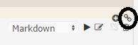

<a name="markdownvsrmarkdowncells"></a>

### Markdown versus RMarkdown Cells

Behind the scenes, RCloud uses several different R packages to render output. Markdown cells use the [markdown](http://cran.r-project.org/web/packages/markdown/index.html) and [knitr](http://yihui.name/knitr/) packages directly for output. RMarkdown cells, on the other hand, use [rmarkdown](http://rmarkdown.rstudio.com/) (a.k.a. R Markdown v2).

Currently RMarkdown support should be considered experimental.

[Top](#TOP)

<a name="notebooks"></a>

## 5. Notebooks

RCloud notebooks are simply collections of prompt and markdown cells, comments, and assets, which we'll get to later. Everything in your public notebooks is searchable by every other user of the system. This encourages reuse and makes learning how to use the hundreds of available R packages easier.

You can also browse everyone else's notebooks by opening the Notebooks section on the left sidebar. To do this, simply click on Notebooks at the top of the panel. This toggles the panel, opening or closing it:


To load a notebook into the current session, click on the name. After it loads, you can examine the source code or click "Run" in the header bar to execute all the cells on the page.

[Top](#TOP)

<a name="creatinganotebook"></a>

### Creating a Notebook

To create a new, blank notebook, click the + sign at the right of the Notebooks panel header area:

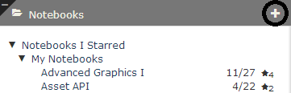

RCloud will automatically choose a title for your new notebook, Notebook N, where N is the next available number among your notebooks. To give your notebook a more meaningful title, click on the [title in the header bar](#notebooktitle).

[Top](#TOP)

<a name="runninganotebook"></a>

### Running a Notebook

To run all the cells in your notebook, click the  icon in the header bar.

RCloud notebooks are executed asynchronously. RCloud will show individual cell results as the results are ready to display.

[Top](#TOP)

<a name="longrunningnotebooks"></a>

### Long-Running Notebooks

Notebooks that run longer than a few seconds will cause the browser screen to dim and a please-wait message to be displayed.

Currently, RCloud has no explicit mechanism to stop a long-running notebook. If you mistakenly launch a long-running notebook, you can simply reload the notebook in another browser tab or reload the page. This doesn't stop the execution behind the scenes, but the output of the previous run will not interrupt your current session. Be careful of side-effects, like changing the contents of a file in your local directory in such a way that it affects the output of the notebook.

[Top](#TOP)

<a name="forkingcopyinganotebook"></a>

### Forking (Copying) a Notebook

To copy another user's notebook, first navigate to it in the left sidebar and then click to load it into your current session. Now, you're running another user's public notebook in your own session. This is sufficient for running reports or performing other read-only activities. If you want to edit the notebook, you'll need to make your own copy, or, "fork" it.

After you've loaded the notebook you want to fork, click the Fork icon in the header bar at the top of the screen:

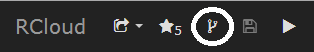

After forking a notebook, you'll own your own copy and therefore be able to edit it.

The fork icon is always available, which means you can fork your own notebooks.  If you are viewing a previous version of a notebook, you can fork a copy of that version. Caution: currently when you fork your own notebook, the history is lost; we hope to fix this soon.

[Top](#TOP)

<a name="savingyourwork"></a>

### Saving Your Work

There are two mechanisms by which your work is saved in RCloud. 

[Top](#TOP)

<a name="manualsaving"></a>

#### Manual Saving

You can save your notebook at any time by clicking the  icon in the header bar.

[Top](#TOP)

<a name="versioning"></a>

#### Versioning

RCloud keeps track of your notebook versions automatically and frequently. Every time you save, create, or run a markdown or prompt cell, the newest version of your notebook is saved. To browse the versions of your notebook, which are stored chronologically with the latest version on top, hover over the name of your notebook in the left sidebar and click the clock icon:

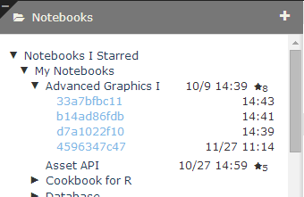

To change they way dates and times are displayed next to your notebook versions, see the [show terse version dates](#showterseversiondates) setting.

[Top](#TOP)

<a name="versiontagging" />

##### Version Tagging

To "tag" a notebook version, click twice on a version name to edit it in place.


Now, rather than referring to a specific notebook version with <code>&version=hash</code> in a URL, you can refer to a specific notebook tag:


<code>&tag=name</code>

This is useful when you want to share a version of a notebook but plan to continue developing it. For example, you can tag a version as the "LatestProductionVersion," and then apply that tag to another version when you're ready to share your new work. This way, existing URLs (perhaps stored in someone's bookmarks) won't break as you update your notebooks.

[Top](#TOP)

<a name="revert"></a>

##### Reverting to a Previous Version

Should you decide that a previous version of your notebook is the "best" version, you can make that version the current version by loading the desired previous version of the notebook and clicking the revert icon.


[Top](#TOP)

<a name="publicandprivatenotebooks"></a>

### Public and Private Notebooks

By default, all RCloud notebooks are public and therefore visible to all RCloud users. If you'd like to toggle the public/private flag on a notebook, hover over the name of your notebook on the left sidebar and click the eye icon. Note that private notebook titles are grayed out for owners and invisible to other users.

[Top](#TOP)

<a name="toggleprivate"></a>

#### Toggle Private

Clicking the  icon will make your notebook private.

[Top](#TOP)

<a name="togglepublic"></a>

#### Toggle Public

Clicking the  icon will make your notebook public.

[Top](#TOP)

<a name="deletingnotebooks"></a>

### Deleting Notebooks

To delete a notebook, hover over the name of your notebook in the left sidebar and click the  icon.

RCloud will ask for a confirmation:


Click OK and the notebook will disappear from the left sidebar and the last-viewed available notebook will automatically load into the current session.

[Top](#TOP)

<a name="sharingyournotebooks"></a>

### Sharing Your Notebooks

There are several ways you can share your notebooks with colleagues. When you click on the downward arrow next to the share icon in the header bar , a popup menu will appear:


This allows you to select the kind of URL you'd like to share. Make your selection using the popup menu and then right click on the  icon to copy the hyperlink.

Note that if you have a tagged version of your notebook currently loaded, where appropriate, RCloud will populate the shared URL with the tag instead of the version. This is beneficial because then you can tag future versions with the same tag and not break existing URLs.

[Top](#TOP)

<a name="view.html"></a>

##### view.html

This is the simplest method. This will create a link that will allow someone to see the notebook code and execute the notebook within the RCloud IDE. Users who do not own the notebook will see the play  and share  icons in the header. Clicking the play icon will execute all cells in the notebook. Clicking the edit icon will return to the normal header, allowing a user to fork the notebook, etc.

[Top](#TOP)

<a name="notebook.R"></a>

##### notebook.R

This option is intended for [FastRweb](http://rforge.net/FastRWeb/) notebooks. Loading the URL (from anywhere, including other notebooks, a perl script, etc.) executes a notebook "behind the scenes" by opening a one-time R session, running the defined "function" within, shutting down the R session, and finally, returning the result.  FastRweb notebooks MUST have a function named 
`function()` defined, as this what notebook.R tries to execute upon instantiation. Output from notebook.R can be anything. Text, binary data, whatever, as this information will ultimately be processed by whatever mechanism that called notebook.R.

notebook.R allows trailing paths to be processed by the notebook code if they start with /.self/. The subsequent path portion is passed to the run function as the .path.info argument. This allows notebooks to handle a "full tree" argument to the notebook on top of a single notebook URL.

E.g.: https://rcloud.mydomain.com/notebook.R/user/notebook/.self/foo/bar will call the notebook with .path.info set to /foo/bar. Note that the .self part distinguishes asset look up from a path info call.

See the [notebook.R URLs](#notebookrurls) section of the documentation for more detailed information about notebook.R URLs.

[Top](#TOP)

<a name="mini.html"></a>

##### mini.html

Unlike notebook.R, mini.html URLs open an R session via a Websocket and keep it open.  Mini.html notebooks MUST have a function named `rcw.result()` defined, as that is what mini.html tries to execute upon instantiation. Because the R session is kept open, users or processes can interact with the R session while the websocket is kept open.

[Top](#TOP)

<a name="shiny.html"></a>

##### shiny.html

RCloud supports the [RStudio Shiny web application framework](#http://shiny.rstudio.com/). To share [Shiny-enabled notebooks](#rstudioshinysupport), select this option. 

[Top](#TOP)

<a name="whostarredmynotebook"></a>

### Who Starred my Notebook?

To find out which users starred your notebook, click the notebook information icon:


[Top](#TOP)

<a name="savingplots"></a>

### Saving Plots

Hover the mouse over a plot created in an R cell to make the disk icon appear in the upper right corner (see 1), which contains a list of available image formats.  A widget at the lower-right corner can be used to resize the image (see 2).

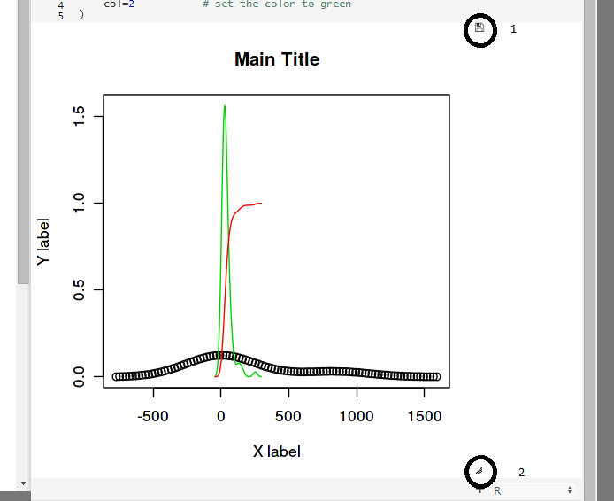

Note that you can only save plots created in R cells.

[Top](#TOP)

<a name="findreplace"></a>

### Find and Find Replace

To find text within your notebook, type Ctrl-F (Win/Linux) or Cmd-F (Mac) to open a find dialog at the top of your notebook:

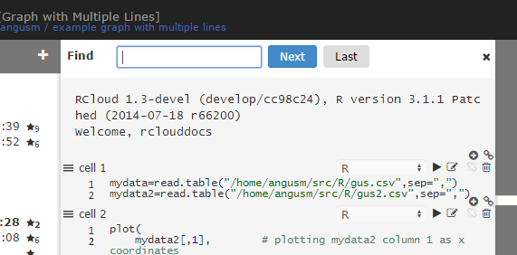

To find and replace text within your notebook, type Ctrl-H (Win/Linux) or Cmd-Option-F (Mac) to open a find and replace dialog at the top of your notebook:


[Top](#TOP)
<a name="dataaccess"></a>

## 6. Data Access

[Top](#TOP)

<a name="fileupload"></a>

#### File Upload

There many ways to use your own data in RCloud. Please see the example notebooks under RCloud Sample Notebooks for some examples. Here, we'll take a closer look at the simplest method: uploading a flat file. Open the File Upload panel on the right sidebar by clicking on the heading. Then, select "Choose File" and browse to a local file, in this case "distrib.csv."


Next, click the "Upload" button. If the file exists (just where, we'll get to in a moment), RCloud prompts with a notice that it will be overwritten. If all goes well, RCloud confirms the upload.

The file now exists in your installation server's home directory and is accessible from within RCloud. For example:

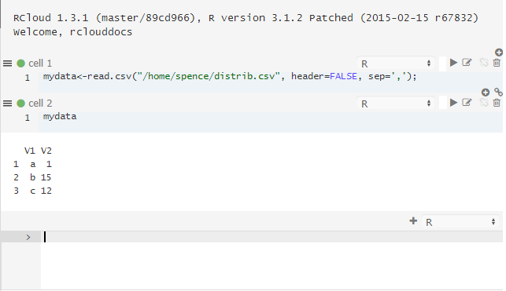

The first line of R code loads the contents of the CSV file into an object called "mydata." The next line tells R to output a string version of the object.

[Top](#TOP)

<a name="uploadtonotebook"></a>

#### Upload to Notebook

The **Upload to Notebook** checkbox changes the way File Upload works. Rather than uploading your file to your home directory, RCloud will store the file inside your notebook as an "asset." To view notebook assets, click on the assets bar on the right sidebar. Please see the [Notebook Assets](#notebookassets) section for more information.

[Top](#TOP)

<a name="notebookassets"></a>

## 7. Notebook Assets

Notebooks can contain "assets," which are files that can be used within your notebooks or simply for keeping track of unused code (as in the the case of scratch.R, which is a text file where you can keep bits of code while working on your notebook).

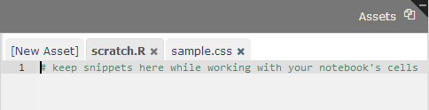

[Top](#TOP)

<a name="dataasanasset"></a>

### Data as an Asset

For example, from the previous example, lets create an asset called distrib.csv that contains the following data:

<pre>
a,1
b,15
c,4
</pre>

We can store this data in a new asset called "distrib.csv," simply by clicking New Asset and typing distrib.csv as a name.

Now, this data is accessible in your R code:


[Top](#TOP)

<a name="uploadingasset"></a>

### Uploading Assets

In addition to manually entering asset text, you can also drag and drop files into the Assets panel to upload them:


[Top](#TOP)

<a name="usingcss"></a>

### Cascading Style Sheets; Using CSS

Assets can contain Cascading Style Sheet (CSS) formatting information. This changes the way information is presented when your notebook is executed. For example, here is a bit of CSS that defines a paragraph style:

    p.mystyle {
      font-size: 20px;
      color: red;
    }

To use this CSS as an asset, it needs to have a special name that begins with "rcloud-" and ends with ".css". In the example below, the name is "rcloud-mystyle.css".

RCloud automatically uses CSS asset files with this file pattern and ignores others, so you can save bits of CSS in other files without worrying about overlap.

To use the p.mystyle paragraph style, simply reference it in markdown using HTML:

    # My Header
    
    Here is a bit of red text:

    <p class="mystyle">This is red.</p>


Note that you must reload your notebook to apply the CSS.

[Top](#TOP)

<a name="jsmode"></a>

### JavaScript

Assets can also contain JavaScript. When editing JavaScript (files must have the .js extension), RCloud automatically uses a JavaScript editing mode, which has built-in syntax checking.


[Top](#TOP)

<a name="assetrename"></a>

### Renaming Assets

To rename an asset, simply click on the file name on the asset's tab.


[Top](#TOP)

<a name="notebookrurls"></a>

## 8. notebook.R URLs

It's possible to construct a URL for a notebook asset by selecting Open in GitHub in the Advanced menu, locating your asset and right-clicking the "View Raw" icon, which looks like <> next to your asset. The URLs look like this:

https://github.mydomain.com/gist/rclouddocs/d2b9231aca224bbbb888/raw/efb98239f9acc030f98b2cd1957ce7c9b4b9f2c3/DummyData.csv

This is unwieldy. A better and more powerful way to access assets is via the HTTP entry point, notebook.R.

Notebook.R allows you to access your notebook in the following ways:

<pre>
http://rcloud.mydomain.com/notebook.R/&lt;notebook-id&gt;
http://rcloud.mydomain.com/notebook.R/&lt;notebook-id&gt;/&lt;version-hash&gt;
http://rcloud.mydomain.com/notebook.R/&lt;notebook-id&gt;/&lt;filename&gt;
http://rcloud.mydomain.com/notebook.R/&lt;notebook-id&gt;/&lt;version-hash&gt;/&lt;filename&gt;
http://rcloud.mydomain.com/notebook.R/&lt;user&gt;/&lt;notebook-name&gt;
http://rcloud.mydomain.com/notebook.R/&lt;user&gt;/&lt;notebook-name&gt;/&lt;filename&gt;
</pre>

URLs ending in "&lt;filename&gt;" will return the given asset (file). To illustrate how it works using the previous example, any of these give HTTP access to the latest version of DummyData.csv:

<pre>
http://rcloud.mydomain.com/notebook.R/d2b9231aca224bbbb888/DummyData.csv
http://rcloud.mydomain.com/notebook.R/rclouddocs/Asset%20API/DummyData.csv
</pre>


Access to assets isn't the only thing you can do with notebook.R. Notice that in the list of ways to access your notebook above, not all methods reference a filename. If you reference a notebook or revision of a notebook, the URL will return the result of the evaluated notebook.

notebook.R is intended to be a general-purpose Remote Procedure Call (RPC) in R. RPCs in RCloud should always contain some [markdown](#Markdowncells) to document what the RPC does, what the arguments are, etc. This way other users can simply view your notebook in RCloud to understand how to use it. This isn't enforced in any way but is encouraged to promote reuse. The markdown is only visible when users visit your notebook in RCloud. The markdown is not output when called remotely.

Please see [the following](https://github.com/att/rcloud/blob/develop/NEWS.md#rcloud-09) for more notebook.R features and information.

[Top](#TOP)

<a name="search"></a>

## 9. Search

To conduct a global text search in all public RCloud notebooks, simply open up the search panel by clicking on Search on the left sidebar. Here are the results for a search on "markdown." RCloud searches code, comments, notebook names, assets, everything.


##### 1

Results can be sorted by the number of stars a notebook has, the author of the notebook (User), the notebook's name, or by the date a notebook was created.

##### 2

Sorts the results in descending (Desc) or ascending (Asc) order. 

##### 3

When too many results are returned for any one notebook, RCloud will display a Show me more link that, when clicked, will toggle the rest of the results.

##### 4

Search results are paginated. Click on any page number below the results or use the  back or  next page to page through the results.

[Top](#TOP)

<a name="complexsearches"></a>

### Complex Searches

RCloud supports Lucene's feature-rich query parser syntax for more complex searches. Features include wildcard, fuzzy, and proximity searches, boolean operators, grouping, and much more.

Please see the [official query parser syntax documentation](http://lucene.apache.org/core/2_9_4/queryparsersyntax.html) for more information.

[Top](#TOP)

<a name="settings"></a>

## 10. Settings

Various aspects of your RCloud session can be changed here.

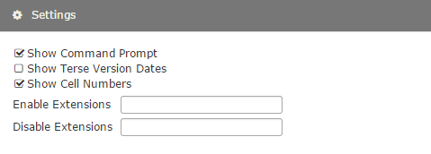

[Top](#TOP)

<a name="showcommandprompt"></a>

### Show Command Prompt

This setting toggles the appearance of the default prompt cell that appears at the bottom of the currently loaded notebook.

[Top](#TOP)

<a name="showterseversiondates"></a>

### Show Terse Version Dates

This controls how RCloud displays dates when viewing notebook versions. When selected, RCloud will display dates and times only when they're different from the version before it.

<a name="comments"></a>

### Subscribe to Comments

When checked, RCloud will send an email whenever someone leaves a [comment](#comments) about your notebook.

[Top](#TOP)

<a name="extensions"></a>

### Extensions

Power users can extend RCloud's user interface with global and per-user extensions. Although this functionality is outside the scope of this document, more information is available [here](https://github.com/att/rcloud/wiki/RCloud-UI-Extensions).

You can enable and disable extensions using the "Enable Extensions" and "Disable Extensions" text boxes. These set the user options `addons` and `skip-addons`, respectively. On starting the session, any extensions listed in `skip-addons` are not loaded.

Enter a list of extensions, comma delimited, and press enter. You will then have to reload the page. 


[Top](#TOP)

<a name="subscribetocomments"></a>


## 11. Comments

Anyone can leave comments about anyone's notebooks in the Comments panel in the right sidebar, as demonstrated below:

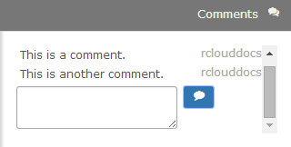

Comments are included in search results.

To submit a comment, simply input your text in the text area and click the comment icon . You can also submit your comment by pressing Ctrl-Enter (Win/Linux) or Cmd-Enter (Mac).

[Top](#TOP)

<a name="editingcomments"></a>

### Editing Comments

To edit a comment, click on the comment text to make changes. Then click Ctrl- or Cmd-Enter to update the comment.


[Top](#TOP)

<a name="deletingcomments"></a>

### Deleting Comments

To delete a comment, hover your mouse over the comment. Click the X next to the comment to delete it.


[Top](#TOP)

<a name="help"></a>

## 12. Help

It's often difficult to remember arguments to functions and what they mean, so RCloud has an inline help feature. In a new prompt cell, type a question mark immediately followed by an R function name and then press Enter/Return to execute the cell:

<pre>
?print
</pre>

If help is available, RCloud will open the Help panel:


Alternatively, you can enter a function name in the text box at the top of the panel and click the help icon .

[Top](#TOP)

<a name="workspace"></a>

## 13. Workspace

In the course of working with your notebook, variables are defined and assigned. Often, it is convenient to know the value of a variable without issuing a command to display it. The Workspace panel displays every variable you've defined along with its value.


In the case of dataframe variables, a link is displayed, which, when clicked, will open up the [Dataframe panel](#dataframe).

[Top](#TOP)

<a name="dataframe"></a>

## 14. Dataframe


Dataframe objects are displayed here after you click a dataframe link in the [Workspace panel](#workspace) or use the View(object) command in a cell:

<pre>
View(a[1:10,])
</pre>

[Top](#TOP)

<a name="session"></a>

## 15. Session

The session panel displays critical system information when available, such as session timeouts. The panel will automatically open when messages are available.


Click the  icon to dismiss a session notification. 

[Top](#TOP)

<a name="rstudioshinysupport"></a>

## 16. RStudio Shiny Support

RCloud contains preliminary support for the [RStudio Shiny web application framework](http://shiny.rstudio.com) via the rcloud.shiny package. rcloud.shiny emulates a network connection to run Shiny on an RCloud server and client instead of a Shiny server. Basic functionality is supported. Shiny extensions are not yet supported.

Although comprehensive documentation of rcloud.shiny is beyond the scope of this document, the implementation is simple enough to get many users already familiar with Shiny started.

<pre>

# Include rcloud.shiny library
library(rcloud.shiny)
# Include all the libraries from ui.R and server.R
library(datasets)

# The rcloud.shinyApp function is the equivalent of the shinyApp
# (http://rmarkdown.rstudio.com/authoring_embedded_shiny.html#inline-applications)
# function in shiny library.
rcloud.shinyApp(
  
  # Pass the ui.R code something as shown below. 
  ui = fluidPage(

    # Application title
    headerPanel("Word Cloud"),
    .
    .
    .
    etc.
</pre>

To learn more about how to use Shiny in RCloud, please see the rcloud.shiny example notebooks under RCloud Sample Notebooks in the Notebooks panel and the [official Shiny documentation](http://shiny.rstudio.com/).

[Top](#TOP)

